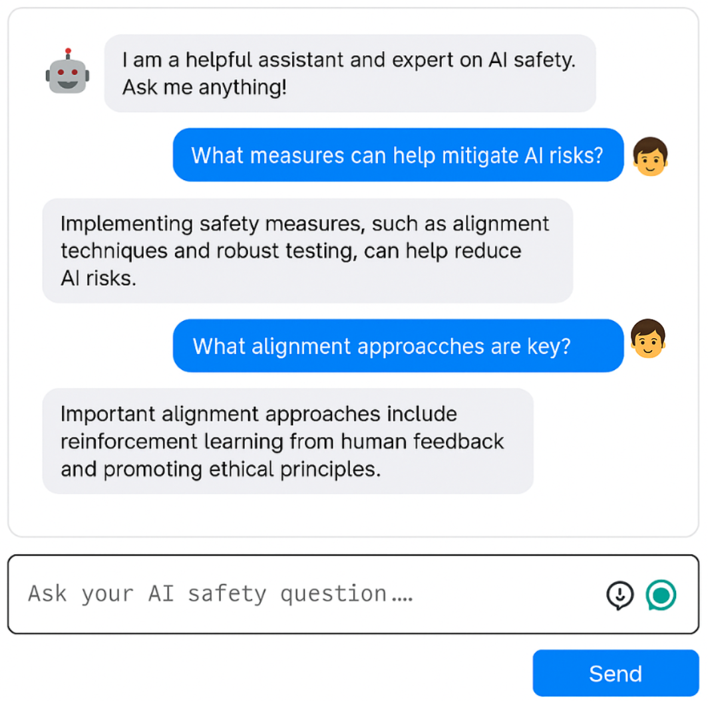

<p align="center">
  
</p>

# 🔍 RAG Chatbot: Retrieval-Augmented Generation on AI Safety Papers

A hands-on implementation of a **RAG-based chatbot** that leverages **OpenAI**, **LangChain**, and **FAISS** to answer questions grounded in a curated collection of AI safety papers.

> 📚 Papers include cutting-edge work on model alignment, jailbreaking, sleeper agents, and data extraction.

---

## 📁 Project Structure

```
.
├── app.py                # FastAPI server for chatbot API
├── main.py               # Core RAG pipeline (load index, query, generate)
├── create_corpus.py      # Process PDFs, extract text, and store in FAISS
├── deploy.py             # Deployment logic (e.g., render setup)
├── faiss_index/          # Contains FAISS index and metadata
├── pdfs/                 # Curated PDF corpus of AI safety papers
├── static/index.html     # Basic web UI for interacting with the chatbot
├── tests/                # Test suite using pytest
```

---

## 🚀 Features

- ✅ **PDF ingestion** using `PyMuPDF`
- ✅ **Semantic search** with `FAISS` and `OpenAIEmbeddings`
- ✅ **Context-aware Q&A** via `LangChain` and OpenAI's LLM
- ✅ **FastAPI** backend to serve responses
- ✅ Minimal **frontend** with a static HTML chat interface
- ✅ **Pytest**-based testing suite for core logic

---

## 🧪 Getting Started

### 1. Install Dependencies

```bash
pip install -r requirements.txt
```

Make sure you're using **Python 3.10+**.

---

### 2. Set Your OpenAI API Key

Create a `.env` file in the project root with the following content:

```bash
OPENAI_API_KEY=your-openai-api-key-here
```

Then make sure the code loads it using `python-dotenv`:

```python
from dotenv import load_dotenv
load_dotenv()
```

> 🔐 **Important:** Never hardcode your API key or commit your `.env` file. Add it to your `.gitignore`.


---

## 🧭 Running the Project

### ▶️ Run in Terminal (Local CLI)

```bash
python main.py
```

This launches the chatbot interface in the terminal and allows direct Q&A with the indexed AI safety corpus.

---

### 🌐 Run on Web (FastAPI + Frontend)

```bash
python app.py
```

Then open your browser at:

```
http://localhost:8000
```

To use the chatbot with a web-based interface. You can also open `static/index.html` directly if not serving via FastAPI.

---

## Update CORPUS
To update the AI safety CORPUS, add the new papers as pdfs inside pdfs/ and run

```bash
python create_corpus.py
```

This script extracts text from all PDFs in `pdfs/`, embeds the content, and saves the index to `faiss_index/`.

## 🧠 Tech Stack

- [LangChain](https://www.langchain.com/)
- [OpenAI API](https://platform.openai.com/)
- [FAISS](https://github.com/facebookresearch/faiss)
- [FastAPI](https://fastapi.tiangolo.com/)
- [PyMuPDF](https://github.com/pymupdf/PyMuPDF)

---

## 👤 Author

**Philippe Bergna**  
🌐 https://philippebergna.github.io

---

## 📄 License

This project is licensed under the MIT License.